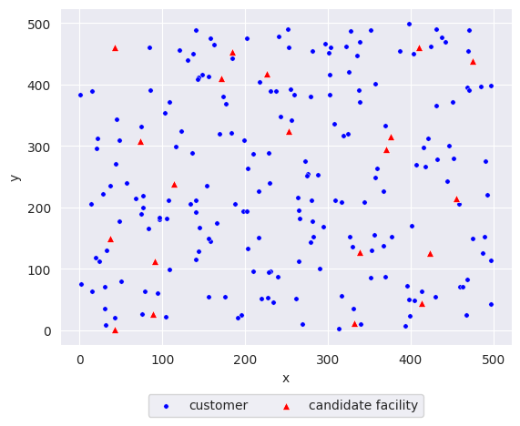
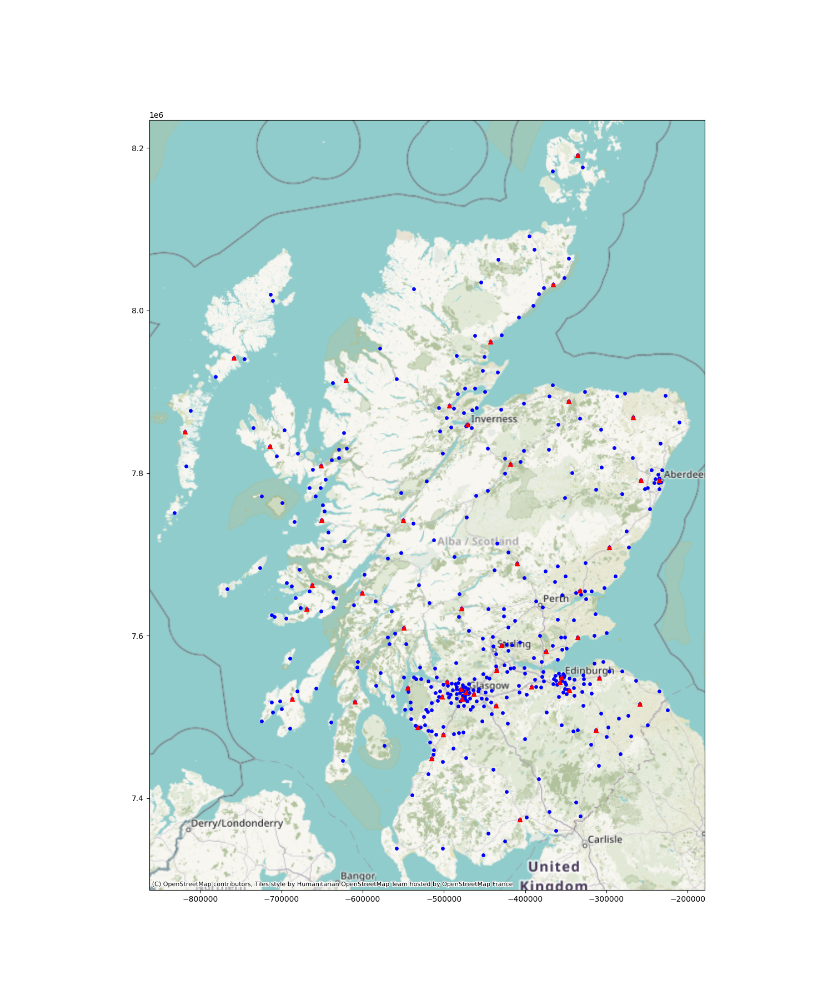

# CFLP-Service-Level-Data
This repository contains the datasets for the paper "Capacitated Facility Location Problem under Uncertainty with Service Level Constraints" by Haoyue Zhanga and Joerg Kalcsics. 

## Random datasets

Stored in ``Random/``, consisting 200 customers and 20 candidate locations in a 500 × 500 area. The seeds used to generate the network is from 1 to 10. 

### network_1-10.npz

|name|Explanation|
|:---:|:---:|
|customers (200)|Coordinates of customer locations|
|candidates (20)|Coordinates of candidate facility locations|
|building_cost (20)|Building cost for each of the candidate facility locations|
|capacity_cost (20)|Capacity cost for each of the candidate facility locations|
|capacity_max (20)|Maximum capacity limitation for each of the candidate facility locations|
|capacity_min (20)|Minimum capacity limitation for each of the candidate facility locations|
|unit_transportation_cost (1)|Transportation cost for transporting 1 unit of demand to 1 unit distance|
|demand (200 $\times$ 200)|demand from customers in 200 scenarios (i $\times$ n)|

## Scotland datasets

Stored in ``Scotland/``, including 440 customers and 50 candidate locations located in Scotland. 

### network_scotland_data_set.npz

|name|Explanation|
|:---:|:---:|
|customers (440)|Coordinates of customer locations|
|candidates (50)|Coordinates of candidate facility locations|
|building_cost (50)|Building cost for each of the candidate facility locations|
|capacity_cost (50)|Capacity cost for each of the candidate facility locations|
|capacity_max (50)|Maximum capacity limitation for each of the candidate facility locations|
|capacity_min (50)|Minimum capacity limitation for each of the candidate facility locations|
|unit_transportation_cost (1)|Transportation cost for transporting 1 ton of to 1 mile|
|transportation_cost (440 $\times$ 50)|Transportation cost for transporting 1 ton of demand from facilities to customers (i $\times$ j)|

### demand_scotland_data_set_1-10.npz

|name|Explanation|
|:---:|:---:|
|demand (440 $\times$ 200)|demand from customers in 200 scenarios (i $\times$ n)|

### network_scotland_data_set_det.npz

Deterministic dataset

|name|Explanation|
|:---:|:---:|
|building_cost (50)|Building cost for each of the candidate facility locations|
|transportation_cost (440 $\times$ 50)|Transportation cost for transporting 1 ton of demand from facilities to customers (i $\times$ j)|
|capacity (50)|Capacity of each candidate facility location|
|demand (440)|Deterministic demand of each customer|